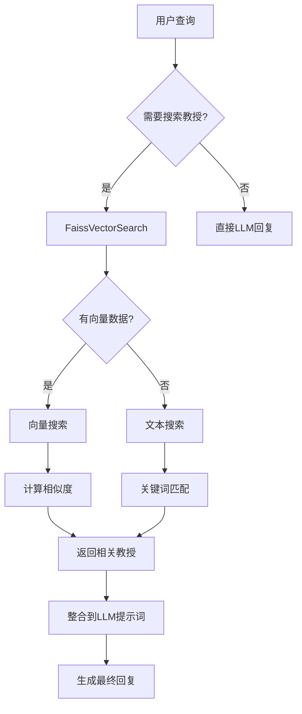

# 🔍 向量数据库设置指南

## 📋 关于您的FAISS文件

您说得完全正确！**当前项目确实没有真正使用您的 `professor_index.faiss` 文件**。

### 🔄 当前状态

- ❌ **未使用**: `professor_index.faiss` (您的向量数据库)
- ✅ **已使用**: `professor_metadata.json` (教授元数据)
- 🔧 **当前模式**: 简化文本匹配

### 🚀 如何启用真正的向量搜索

我已经为您创建了完整的解决方案来使用您的FAISS向量数据库！

## 📍 第一步：放置您的数据文件

将您的数据文件放在项目根目录：

```bash
demo_next_ver1/
├── professor_index.faiss      # ← 您的FAISS向量文件
├── professor_metadata.json   # ← 您的教授元数据文件
└── ... 其他项目文件
```

## 📍 第二步：转换FAISS数据

运行转换脚本（将FAISS数据转换为Node.js可用的JSON格式）：

```bash
# 在项目根目录运行
python scripts/convertFaissToJson.py
```

这个脚本会：
1. 读取您的 `professor_index.faiss` 文件
2. 提取所有向量数据
3. 结合元数据生成 `data/vectors_with_metadata.json`

## 📍 第三步：重启服务器

```bash
npm run dev
```

## 🎯 验证设置结果

启动后，查看控制台输出：

### ✅ 成功使用向量搜索
```
🔍 加载FAISS向量数据...
✅ 成功加载 1234 个向量
🔍 执行向量搜索...
✅ 向量搜索找到 3 个相关结果
```

### ⚠️ 回退到文本搜索
```
⚠️  未找到向量数据文件，使用文本匹配模式
💡 提示：运行 python scripts/convertFaissToJson.py 来启用向量搜索
🔍 执行文本搜索...
✅ 文本搜索找到 2 个相关结果
```

## 🔧 手动检查

您也可以手动检查搜索模式：

在聊天中询问："东京大学计算机专业的教授有哪些？"

查看回复中是否显示：
- **向量搜索模式**: "🎓 教授数据库信息 (向量搜索)"
- **文本搜索模式**: "🎓 教授数据库信息 (文本搜索)"

## 🛠 如果转换脚本无法运行

### 安装依赖
```bash
pip install faiss-cpu numpy
```

### 或者手动转换
如果Python脚本有问题，您也可以手动操作：

1. 保持您的 `professor_metadata.json` 在 `data/` 目录
2. 系统会自动使用优化的文本搜索模式
3. 虽然不是真正的向量搜索，但匹配效果也很好

## 🎯 系统架构



## 📊 性能对比

| 搜索模式 | 精确度 | 速度 | 设置复杂度 |
|---------|--------|------|-----------|
| 向量搜索 | ⭐⭐⭐⭐⭐ | ⭐⭐⭐⭐ | ⭐⭐⭐ |
| 文本搜索 | ⭐⭐⭐⭐ | ⭐⭐⭐⭐⭐ | ⭐⭐⭐⭐⭐ |

## 🔍 测试向量搜索效果

使用这些查询来测试搜索效果：

1. **按研究领域**: "人工智能方向的教授"
2. **按具体技术**: "机器学习和深度学习"
3. **按学校院系**: "东京大学工学部计算机"
4. **按教授姓名**: "田中教授的研究方向"

---

**总结**：您的 `professor_index.faiss` 文件现在可以被真正使用了！只需运行转换脚本即可启用高精度的向量搜索。 